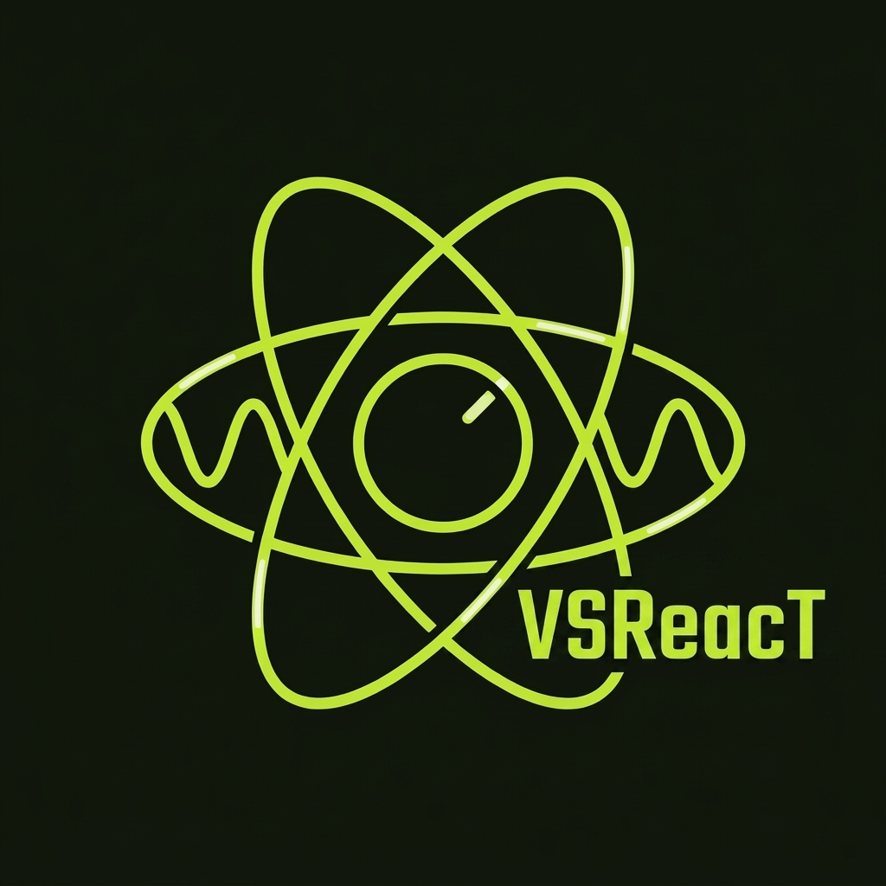

<p align="center">
  
</p>

<h1 align="center">VSReacT</h1>

<p align="center">
  <strong>Write React. Ship native VST.</strong><br/>
  A React renderer for JUCE audio plugins — no webview, no LookAndFeel fights, no janky workarounds.
</p>

<p align="center">
  <a href="https://vsreact.n9records.com"><strong>vsreact.n9records.com</strong></a>
</p>

<p align="center">
  <a href="https://github.com/N9RecordsTechnologiesIL/VSReacT/actions/workflows/ci.yml"></a>
  
  
  
</p>

---

```tsx
import { render, View, ParamKnob } from "vsreact";

function App() {
  return (
    <View className="flex-1 items-center justify-center bg-zinc-950 gap-10 flex-row">
      <ParamKnob paramId="gain" size={88} />
      <ParamKnob paramId="pan" size={88} />
    </View>
  );
}

render(<App />);   // that's the whole plugin UI
```

Your TSX runs in an embedded **QuickJS** engine inside the plugin. A custom
**react-reconciler** streams the element tree to C++ as mutation ops. A C++
shadow tree lays out with **Yoga** (React Native's flexbox engine) and
**juce::Graphics paints every pixel** — rounded corners, knob arcs, shadows,
text — identically on every OS and in every DAW.

```
Your React app (TSX)
  → react-reconciler host config      runs in QuickJS inside the plugin
  → JSON mutation ops over a C bridge
  → C++ shadow tree
  → Yoga flexbox layout
  → juce::Graphics                    every pixel native, 60fps
```

## Why

Plugin UIs deserve the modern component model — hooks, state, hot reload,
utility-class styling — without embedding a browser or wrestling JUCE's
LookAndFeel. VSReacT is the Flutter/React-Native-Skia approach applied to
audio software: the framework owns every pixel, so beautiful is the default.

## Features

- **Modern React 18** — function components, hooks, effects; the API you already know.
- **Tailwind-style classes** — `className="flex-1 bg-zinc-950 rounded-xl border hover:bg-lime-300"`,
  with theme tokens, arbitrary values, and `hover:`/`active:`/`focus:` variants. Resolved in JS; C++ only sees final styles.
- **Audio parameter binding** — `useParameter(id)` and `<ParamKnob>`/`<ParamSlider>`
  bind two-way to a `juce::AudioProcessorValueTreeState` with automation-safe
  begin/end gestures, via `vsreact::ParameterBridge`.
- **Real controls** — natively painted knob arcs, drag gestures with pixel
  deltas, wheel-scroll containers with painted thumbs, a `useTween` animation API.
- **Real text input** — a chrome-stripped `juce::TextEditor` positioned by
  Yoga: real caret, selection, IME; VSReacT paints the box and focus ring.
- **Native escape hatch** — `<NativeView nativeId="waveform">` mounts any
  registered `juce::Component` inside the React layout.
- **Native messaging** — `native.call(name, args)` invokes C++ handlers
  synchronously; C++ pushes events to `native.on(name, cb)` listeners.
- **Hot reload in the DAW** — dev builds watch the bundle file; save, rebuild,
  and the running plugin remounts in ~100 ms. Production embeds the bundle in the binary.
- **Error overlay** — JS exceptions render a red box with the stack trace instead of dying silently.

## Install

Requires CMake 3.22+, a C++17 toolchain, [JUCE 8](https://github.com/juce-framework/JUCE), and [Bun](https://bun.sh) (or any Node package manager).

**The UI package:**

```bash
bun add vsreact    # or: npm install vsreact / yarn add vsreact / pnpm add vsreact
```

**The native module** — CMake fetches it, pinned to a tag (place after JUCE is added):

```cmake
include(FetchContent)
FetchContent_Declare(vsreact
    GIT_REPOSITORY https://github.com/N9RecordsTechnologiesIL/VSReacT.git
    GIT_TAG        v0.0.1
    SOURCE_SUBDIR  vsreact)
FetchContent_MakeAvailable(vsreact)

target_link_libraries(MyPlugin PRIVATE vsreact)
```

## Quick start

Drop a `RootView` into your plugin editor:

```cpp
vsreact::RootOptions options;
options.bundleFile = juce::File ("path/to/build/main.js");  // dev: watched + hot reload
options.watchForChanges = true;
options.onNativeCall = [this] (const juce::String& name, const juce::var& args) -> juce::var {
    if (auto handled = bridge.handleNativeCall (name, args))   // APVTS binding
        return *handled;
    return {};                                                 // your app calls
};

root = std::make_unique<vsreact::RootView> (std::move (options), std::move (registry));
bridge.attach (*root);
addAndMakeVisible (*root);
```

The fastest full tour is the bundled example — a working gain/pan plugin
whose UI is the fourteen lines above:

```bash
git clone https://github.com/N9RecordsTechnologiesIL/VSReacT.git && cd VSReacT
cd vsreact/examples/gain/ui && bun install && bun run build && cd ..
cmake -S . -B build -DJUCE_SOURCE_DIR=path/to/JUCE   # -G "Visual Studio 17 2022" -A x64 on Windows
cmake --build build --target GainExample_Standalone --config Release
```

Full documentation at **[vsreact.n9records.com/docs](https://vsreact.n9records.com/docs)** —
installation, the complete JS and C++ API, styling reference, parameter
binding, hot reload, and architecture.

## Built with VSReacT

**[StashTrack](https://github.com/N9RecordsTechnologiesIL/StashTrack)** — a
production VST3 for Windows/macOS/Linux whose entire UI is a VSReacT app:
splash screen, live download progress, preview playback, an animated
scrollable stash drawer. It's also this repo's proving ground — the StashTrack
checkout nests inside this repository as `StashTrack/` (its own git repo).

## Repository layout

- `vsreact/module/` — the JUCE module: QuickJS runtime, bridge, shadow tree,
  Yoga adapter, painter, hit-testing, TextInput host, ParameterBridge, RootView.
- `vsreact/js/` — `vsreact`: reconciler host config, primitives,
  tailwind resolver, `useParameter`, `Knob`/`Slider`, `useTween`, runtime shims.
- `vsreact/examples/gain/` — the two-knob example plugin.
- `vsreact/third_party/` — vendored quickjs-ng (v0.15.1) and Yoga (v2.0.1).
- `vsreact/tests/` + `vsreact/js/*.test.*` — C++ (CTest) and TS (`bun test`) suites.
- `site/` — the framework's website (Next.js).
- `ci/` — CI entry point building the module + tests against a JUCE checkout
  (Windows + macOS on every push).

## Testing

```bash
cd vsreact/js && bun test                       # reconciler, resolver, controls
cmake -S ci -B ci/build -DJUCE_SOURCE_DIR=path/to/JUCE -DCMAKE_BUILD_TYPE=Release
cmake --build ci/build --config Release && ctest --test-dir ci/build -C Release
```

## Links & support

- Website: [vsreact.n9records.com](https://vsreact.n9records.com)
- Issues: [github.com/N9RecordsTechnologiesIL/VSReacT/issues](https://github.com/N9RecordsTechnologiesIL/VSReacT/issues)
- Contact: [vsreact-support@n9records.com](mailto:vsreact-support@n9records.com)

## License

[MIT](LICENSE) for the VSReacT framework. Vendored third-party engines
(QuickJS-ng, Yoga) keep their own licenses under `vsreact/third_party/`, and
JUCE has its own commercial/GPL terms you must satisfy for plugin
distribution.
